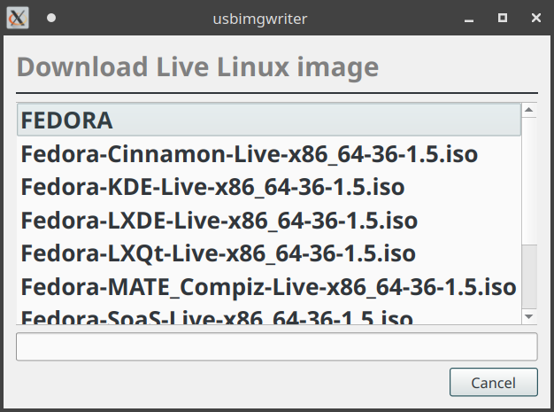

UsbImgWriter
============

This is a graphical tool for writing (ISO) image files to USB devices.

Select the source image file like a Linux ISO file.
Select the target device from the list - all detected USB devices are listed.
If a USB thumbdrive contains multiple partitions, only the device is listed.
If the selected device is already mounted, you'll be asked to unmount it.

The selected image file is written to that USB device, wiping it.
When you're done, you'll be able to boot from it.

Download
--------

You can download this tool on the "[Releases](https://github.com/c0xc/UsbImgWriter/releases)" page.
It should run on most Linux desktops, it could also be used in a Live system.

Live Linux
----------

This tool has a Live Linux downloader, which gives you a limited selection
of Linux flavors. You can select one by double-clicking through
the listed releases and on the desired image file.
It will be downloaded and selected as source image,
which can then be written to the USB device.

Live Linux images can be very useful,
for example if you're in a hostile (untrusted) environment
where you have to recover some files from a computer
or work on a network setup which may require debugging...
The point is, these image files aren't just for installing Linux.

Author
------

Philip Seeger (philip@c0xc.net)

