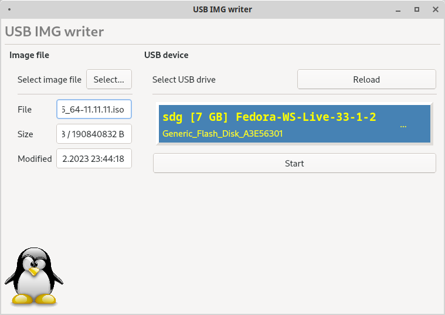

UsbImgWriter
============

This is a graphical tool for writing (ISO) image files to USB devices.

Select the source image file like a Linux ISO file.
Select the target device from the list - all detected USB devices are listed.
If a USB thumbdrive contains multiple partitions, only the device is listed.
If the selected device is already mounted, you'll be asked to unmount it.

The selected image file is written to that USB device, wiping it.
When you're done, you'll be able to boot from it.

